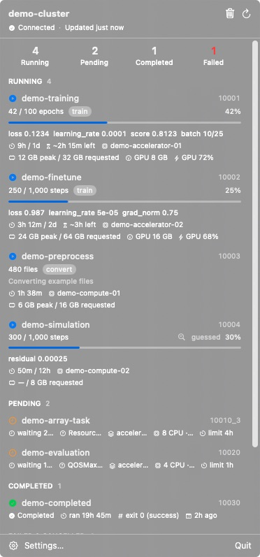
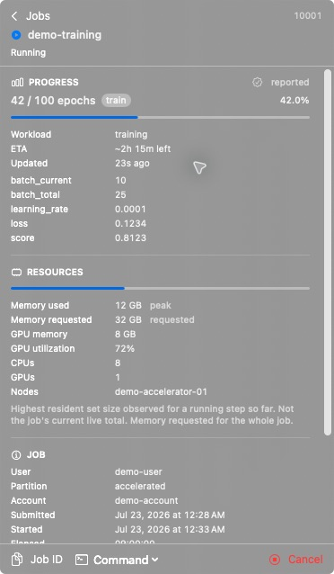
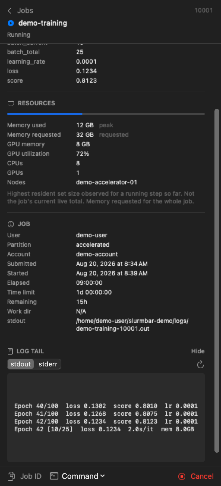

<p align="center">
  
</p>

<h1 align="center">SlurmBar</h1>

<p align="center"><strong>Your Slurm jobs at a glance.</strong></p>

A native macOS menu bar app for monitoring Slurm jobs on remote HPC clusters over SSH. Running
and pending jobs, training progress, runtime, memory, logs and failures — without keeping a
terminal open and without running anything persistent on the cluster.

**New here? Go straight to the [Quickstart](#quickstart)** — it takes about fifteen minutes and
assumes no prior SSH setup.

---

## What it does

SlurmBar polls a cluster login node over your existing SSH configuration, runs a small one-shot
Python script there, and renders the JSON it prints. That's the whole design.

- **Live queue** — running, pending and recently finished jobs, with elapsed time against the
  time limit, pending reasons, node and partition, exit codes.
- **Real training progress** — epoch 375/1000, current phase, loss, batch, ETA — when your
  workload opts in via the three-line `slurmbar_progress` integration.
- **Honest resources** — memory usage always carries its semantics (`peak`, `per node`,
  `requested`). Anything Slurm doesn't report shows as `N/A`, never as a fabricated number.
- **Bounded log tails** — the last 200 lines of stdout or stderr, fetched only when you ask.
- **Native notifications** on completion, failure, timeout, OOM, and NaN loss — edge-triggered,
  so a failed job notifies once, not on every poll.
- **Works offline** — the last successful snapshot stays visible, clearly marked stale, when the
  VPN drops.

## What it is *not*

No daemon on the cluster. No open ports. No root. No `slurmrestd`. No stored SSH keys, no
password prompts, no bypassing `known_hosts`. No web view, no Electron.

---

## Screenshots

All screenshots use the repository's fabricated `demo-cluster` data. They do not show a real
cluster, account, node, path or job.

<p align="center">
  
</p>

<p align="center">
  
  
</p>

---

## Quickstart

Fifteen minutes from nothing to jobs in your menu bar. Every step ends with a check, so you
always know whether to continue or stop and fix something.

**You need:** a Mac on macOS 14+, [Xcode](https://apps.apple.com/app/xcode/id497799835)
(SlurmBar is built from source — there is no prebuilt download yet), and an account on a
cluster that runs Slurm.

---

### Step 1 — Make sure you can reach the cluster

Open **Terminal** (press `⌘ Space`, type `Terminal`, press Return) and log in the ordinary way:

```bash
ssh your-username@login.your-cluster.edu
```

Use the host name and username from your cluster account email or your site's documentation.
Type `exit` to come back once you are in.

> **It asked for a password or a one-time code?** That's fine and very common — keep going,
> Step 3 handles it.
>
> **It said `Could not resolve hostname`?** The host name is wrong. Check your site's docs.
>
> **It said `Permission denied`?** Your account or key isn't set up yet. Sort that out with
> your cluster's support before continuing — SlurmBar cannot help until plain `ssh` works.

**Check:** you logged in and back out. ✅

---

### Step 2 — Give the cluster a short name

SlurmBar identifies a cluster by an **SSH alias** — a nickname defined in `~/.ssh/config`.
Create or edit that file:

```bash
mkdir -p ~/.ssh && chmod 700 ~/.ssh
open -e ~/.ssh/config
```

Add this at the end, changing the three values to your own:

```sshconfig
Host mycluster
    HostName login.your-cluster.edu
    User your-username

    # Reuse one connection for every poll instead of logging in each time.
    ControlMaster auto
    ControlPath ~/.ssh/cm-%r@%h:%p
    ControlPersist 8h
```

`Host mycluster` is the nickname — pick anything short. Save and close.

**Check:** this now works and prints your cluster's host name:

```bash
ssh mycluster hostname
```

---

### Step 3 — Confirm SlurmBar will be allowed to connect

SlurmBar runs `ssh` with `BatchMode=yes`, meaning **it can never show a password or one-time-code
prompt**. That is deliberate: it means SlurmBar can't be tricked into collecting your
credentials. It also means the connection has to already be usable without typing anything.

Run exactly this:

```bash
ssh -o BatchMode=yes mycluster true && echo "SlurmBar can connect"
```

**If it printed `SlurmBar can connect`** — you're done with SSH. Go to Step 4.

**If it printed `Permission denied (publickey)`** — you're using password login. Set up a key
once:

```bash
ssh-keygen -t ed25519          # press Return at every prompt
ssh-copy-id mycluster          # asks for your cluster password one last time
```

Then run the check again.

**If it printed `Permission denied (keyboard-interactive)`** — your cluster requires a one-time
code (2FA/OTP). Keys can't bypass that, so SlurmBar reuses a connection you open yourself:

```bash
ssh mycluster                  # log in normally, complete the OTP, then leave this open
                               # or type `exit` — ControlPersist keeps it alive
```

Now run the check again — it should print `SlurmBar can connect`, because the `ControlMaster`
lines from Step 2 let it ride on the connection you just made. The `ControlPersist 8h` setting
keeps that alive for eight hours; after it lapses, just `ssh mycluster` once more.

**Check:** `ssh -o BatchMode=yes mycluster true` succeeds. ✅

---

### Step 4 — Install the helper on the cluster

```bash
git clone https://github.com/choulinc/SlurmBar.git
cd SlurmBar
./scripts/install-agent.sh mycluster
```

This copies one ~45 KB Python file into **your own home directory** on the cluster
(`~/.local/share/slurmbar/`). No `sudo`, nothing outside your home directory, no background
service, and your shell startup files are left alone.

It finishes by printing a health report:

```
  [  ok  ] Remote Python: 3.9.21
  [  ok  ] Slurm commands: squeue, sacct, sstat, scancel, scontrol, sinfo
  [  ok  ] Slurm version: slurm 24.05.0
  [  ok  ] squeue: 8 job(s) in queue
  [  ok  ] squeue --json
  [  ok  ] Accounting (sacct)
  [ warn ] Progress directory
           Not present yet. It is created the first time a job reports progress.

  Overall: ready
```

`Overall: ready` is what matters. A `warn` on the progress directory is normal and expected —
see Step 7.

**Check:** the report ends with `Overall: ready`. ✅

---

### Step 5 — Build and open the app

```bash
./scripts/build-macos-app.sh
open out/SlurmBar.app
```

The first build takes a minute or two.

**SlurmBar has no window and no Dock icon.** Look at the right-hand end of your menu bar for a
small server icon (▤). That icon *is* the app.

**Check:** the icon is in your menu bar. ✅

---

### Step 6 — Point it at your cluster

Click the menu bar icon → **Settings…** → **Clusters** tab → **+**, then fill in:

| Field | What to type |
| --- | --- |
| Display name | Anything, e.g. `My Cluster` |
| SSH alias | `mycluster` — the nickname from Step 2 |
| Agent command | `python3 ~/.local/share/slurmbar/slurmbar-agent.pyz` |

Leave everything else at its default. Click **Test Connection** — you should get a list of green
checks. Then click **Save**.

Close Settings and click the menu bar icon.

**Check:** you see your running and pending jobs, with elapsed time, partition and memory. ✅

If you have no jobs queued right now, you'll see "No jobs" — that's correct. Submit something,
wait up to 30 seconds, and it will appear.

---

### Step 7 — (Optional) See training progress, not just "RUNNING"

Slurm knows your job is `RUNNING`. It has **no idea** it's on epoch 375 of 1000 — no monitoring
tool can know that unless your code says so.

SlurmBar tries two things:

1. **It reads your log.** If your job prints something like `Epoch 35/100`, SlurmBar picks it up
   automatically with no work from you. It labels this **"guessed"**, because it is.
2. **Your script reports directly.** Three lines, and you get exact numbers plus a real ETA.

For option 2, copy the SDK to the cluster:

```bash
scp -r progress/slurmbar_progress mycluster:~/
```

If that fails with `scp: Connection closed`, your site has disabled the subsystem `scp` uses.
Pipe it over the SSH connection instead:

```bash
tar czf - -C progress slurmbar_progress | ssh mycluster 'tar xzf -'
```

Then in your training script:

```python
from slurmbar_progress import ProgressReporter

reporter = ProgressReporter(kind="training")

for epoch in range(total_epochs):
    loss = train_one_epoch()
    reporter.update(current=epoch + 1, total=total_epochs, unit="epoch",
                    metrics={"loss": float(loss)})

reporter.complete()
```

Calling `update()` every batch is fine — it writes to disk at most once every 5 seconds. It can
never crash your job: every call swallows its own errors.

**Check:** your next job shows an epoch counter and progress bar. ✅

---

### If something goes wrong

The single most useful command — run it and read what it says:

```bash
ssh mycluster 'python3 ~/.local/share/slurmbar/slurmbar-agent.pyz doctor --json'
```

| What you see | What to do |
| --- | --- |
| Menu bar says **"Interactive login required"** | Your OTP session expired. Run `ssh mycluster` in Terminal again. |
| Menu bar says **"Cluster unreachable"** | Off the VPN, or the network dropped. Your last known jobs stay visible, marked stale. |
| Menu bar says **"Agent not installed"** | Re-run `./scripts/install-agent.sh mycluster`. |
| **"response was not valid JSON"** | Something in your shell startup prints a banner. `ssh mycluster true` should print *nothing*. |
| No finished jobs listed | Your site has Slurm accounting turned off. Running and pending jobs still work. |
| Memory shows `N/A` | Slurm genuinely didn't report it. SlurmBar shows `N/A` rather than making a number up. |

Longer list: [docs/troubleshooting.md](docs/troubleshooting.md).

---

## Architecture

```
      macOS                                    Cluster login node
┌────────────────────┐                     ┌──────────────────────────┐
│  SlurmBar.app      │                     │                          │
│  SwiftUI           │   /usr/bin/ssh      │  slurmbar-agent.pyz      │
│  MenuBarExtra      │ ──────────────────► │  (one-shot, ~44 KB)      │
│                    │   BatchMode=yes     │       │                  │
│  ┌──────────────┐  │                     │       ├─► squeue         │
│  │ SlurmBarKit  │  │ ◄────────────────── │       ├─► sacct          │
│  │ all logic,   │  │   normalized JSON   │       ├─► sstat          │
│  │ fully tested │  │   (schema v1)       │       ├─► status.json ◄──┼── slurmbar_progress
│  └──────────────┘  │                     │       └─► log tail       │      (your job)
└────────────────────┘                     └──────────────────────────┘
```

Three components:

| Component | Where it runs | What it is |
| --- | --- | --- |
| `SlurmBar.app` | Your Mac | Swift/SwiftUI menu bar app. Launches `/usr/bin/ssh`; no embedded SSH. |
| `slurmbar-agent` | Cluster login node | One-shot Python 3 CLI. Stdlib only. Prints JSON, exits. |
| `slurmbar_progress` | Inside your job | Optional ~200-line Python module. Writes progress atomically to a shared filesystem. |

The connection is always outbound from your Mac. The cluster never connects back.

### Repository layout

```
SlurmBar/
├── app/                     Swift package (SwiftPM, not a checked-in .xcodeproj)
│   ├── Sources/SlurmBarKit/   all logic: protocol, SSH, polling, notifications, formatting
│   ├── Sources/SlurmBar/      SwiftUI views only
│   ├── Tests/                 Swift unit and integration tests
│   └── Resources/Info.plist
├── agent/                   slurmbar-agent + Python tests
├── progress/                slurmbar_progress SDK + examples + tests
├── protocol/                JSON Schema + example payloads (the shared contract)
├── fixtures/                synthetic squeue/sacct/sstat/log output
├── design/icon/             app icon artwork (1024px masters)
├── scripts/                 build, install, uninstall, icon generation
└── docs/                    architecture, protocol, installation, troubleshooting, security
```

---

## Requirements

**Mac:** macOS 14 or later. Xcode 15+ (or Swift 5.9+ toolchain) to build.
**Cluster:** SSH access that already works non-interactively, Python 3.7+, and Slurm client
commands (`squeue` at minimum) on `PATH` for non-login shells.

You do **not** need root, a Slurm admin, `slurmrestd`, or accounting to be enabled. Missing
pieces degrade into structured warnings rather than errors.

---

## Installation reference

The [Quickstart](#quickstart) is the short path. This section explains the same steps in more
detail, plus the options it skips.

### 1. Install the remote agent

```bash
git clone https://github.com/choulinc/SlurmBar.git
cd SlurmBar
./scripts/install-agent.sh my-cluster        # your ~/.ssh/config Host alias
```

That builds a zipapp, copies one file to `~/.local/share/slurmbar/` in **your** home directory
on the cluster, writes a launcher into `~/.local/bin/`, and runs `doctor`:

```
  [  ok  ] SlurmBar agent: 0.1.0
  [  ok  ] Remote Python: 3.9.18
  [  ok  ] Slurm commands: squeue, sacct, sstat, scancel, scontrol, sinfo
  [  ok  ] Slurm version: slurm 23.11.7
  [  ok  ] squeue: 4 job(s) in queue
  [  ok  ] squeue --json
  [  ok  ] Accounting (sacct)
  [ warn ] Progress directory
           Not present yet. It is created the first time a job reports progress.

  Overall: ready
```

The installer never uses `sudo`, never writes outside your home directory, and never touches
`.bashrc`, `.zshrc` or any other startup file. If `~/.local/bin` isn't on your `PATH`, that's
fine — SlurmBar always calls the `.pyz` by its full path.

To remove it: `./scripts/uninstall-agent.sh my-cluster`.

### 2. Build and run the Mac app

```bash
./scripts/build-macos-app.sh
open out/SlurmBar.app
```

Or in Xcode: `xed app/`, then run the `SlurmBar` scheme.

SlurmBar has no Dock icon and no window — look for the server icon in the menu bar. Open its
Settings and add a cluster:

| Field | Value |
| --- | --- |
| Display name | `My Cluster` |
| SSH alias | `my-cluster` |
| Agent command | `python3 ~/.local/share/slurmbar/slurmbar-agent.pyz` |
| Polling interval | `30` seconds |

Click **Test Connection** to confirm SSH, Python, Slurm, JSON output and accounting.

For **Launch at Login**, copy the app to `/Applications` first — `SMAppService` requires it.

### 3. SSH configuration

SlurmBar uses your existing OpenSSH setup verbatim. A typical `~/.ssh/config`:

```sshconfig
Host my-cluster
    HostName login.example.org
    User exampleuser
    IdentityFile ~/.ssh/id_ed25519

    # Optional but recommended: reuse one connection across polls.
    ControlMaster auto
    ControlPath ~/.ssh/cm-%r@%h:%p
    ControlPersist 10m

    # Through a bastion, if needed:
    # ProxyJump bastion.example.org
```

`ControlMaster` is worth setting up: it turns each poll into a multiplexed channel on an
existing connection instead of a fresh TCP+auth handshake.

**The rule:** if `ssh my-cluster true` works in Terminal without prompting, SlurmBar works. If it
prompts for anything, SlurmBar will report an actionable error rather than prompting — it runs
`ssh` with `BatchMode=yes` and never disables host key checking.

### Clusters that require an OTP or password

Many HPC sites require interactive authentication (a one-time code, or keyboard-interactive
login). `BatchMode=yes` cannot answer those prompts, so a *fresh* connection will always fail
with `Permission denied (keyboard-interactive)`.

SlurmBar still works on such clusters — through connection reuse:

```sshconfig
Host my-cluster
    ControlMaster auto
    ControlPath ~/.ssh/cm-%r@%h:%p
    ControlPersist 8h        # long enough to cover a working day
```

1. Run `ssh my-cluster` once in Terminal and complete the interactive login.
2. That establishes the master connection; SlurmBar reuses it for every poll, and each poll
   resets the `ControlPersist` timer.
3. When the master eventually expires, SlurmBar reports **"Interactive login required"** with
   instructions rather than a misleading key error.

A short `ControlPersist` (the OpenSSH default is off, and 10 minutes is a common setting) means
the connection dies whenever you stop polling for that long — raise it if you want SlurmBar to
keep working after your Mac sleeps.

---

## Progress reporting

### What Slurm knows, and what it doesn't

This is the most important thing to understand about SlurmBar.

**Slurm knows:** job state, node allocation, CPU/GPU/memory *requests*, elapsed time, time
limits, exit codes, and — if accounting is enabled — peak RSS per job step.

**Slurm does not know:** which epoch your training is on, what your loss is, how many files your
preprocessing job has converted, or which timestep your simulation has reached. Slurm sees a
process using CPU. It has no idea what that process is doing.

So SlurmBar gets application-level progress from one of two places, and always tells you which:

1. **`slurmbar_progress`** (`source: structured_file`) — your workload reports directly.
   Exact, and the only source that can produce a trustworthy ETA.
2. **Log parsing** (`source: log_parser`) — a conservative fallback that reads the tail of your
   job's stdout looking for patterns like `Epoch 375/1000`. It is labelled **guessed** in the
   UI, never produces an ETA, and is skipped entirely when structured progress exists.

A job with neither still appears with full Slurm state, runtime and resources. You just don't
get an epoch counter.

### Integrating the SDK

Copy `progress/slurmbar_progress/` next to your training script, or `pip install --user
./progress`. It is pure standard library.

```python
from slurmbar_progress import ProgressReporter

reporter = ProgressReporter(kind="training")

for epoch in range(start_epoch, total_epochs):
    loss = train_one_epoch()

    reporter.update(
        current=epoch + 1,
        total=total_epochs,
        unit="epoch",
        phase="train",
        metrics={
            "loss": float(loss),
            "learning_rate": float(lr),
            "batch_current": batch_index,
            "batch_total": total_batches,
        },
    )

reporter.complete(message="Training finished")
```

That's the whole integration. It picks up `$SLURM_JOB_ID` (and array-task ids) automatically,
works outside Slurm for local testing, and writes to `~/.local/state/slurmbar/jobs/<job_id>/`.

Two properties worth knowing:

- **Calling it every batch is fine.** Writes are rate-limited to one per 5 seconds by default,
  so a per-batch call becomes a trickle rather than a metadata storm on a parallel filesystem.
  Phase changes, completion and failure always force an immediate write.
- **It cannot break your job.** Every method swallows its own errors. A full disk or a hung
  mount degrades SlurmBar's display; it does not kill a 40-hour training run.

Use the context manager to record crashes too:

```python
with ProgressReporter(kind="training") as reporter:
    ...   # marks completed on clean exit, failed (with the exception) on a crash
```

Non-training workloads use the same API — see `progress/examples/generic_workload.py`:

```python
reporter = ProgressReporter(kind="preprocessing")
reporter.update(current=files_done, unit="file")          # total unknown → no fake percentage
reporter.update(current=step, total=n_steps, unit="timestep")
reporter.update(current=trial, total=n_trials, unit="trial", metrics={"best_score": best})
```

---

## Metrics: available and unavailable

| Metric | Source | Notes |
| --- | --- | --- |
| Job state, partition, nodes, CPUs | `squeue` / `sacct` | Always available. |
| Elapsed time, time limit | `squeue` / `sacct` | Unlimited limits show as no limit, not `0`. |
| Pending reason | `squeue` | e.g. `Resources`, `QOSMaxJobsPerUserLimit`. |
| Exit code, signal | `sacct` | Requires accounting. |
| Peak memory (running) | `sstat` | `MaxRSS` — a **peak for one step**, not live job total. |
| Peak memory (finished) | `sacct` | Largest single step's `MaxRSS`. Not summed across nodes. |
| Requested memory | `squeue` / `sacct` | May be **per node** or **per CPU**; labelled accordingly. |
| GPU count | Slurm TRES | Requested count. |
| GPU memory / utilization | `sacct`/`sstat` TRES | **Only** if your site's accounting records `gres/gpumem`. Usually `N/A`. |
| Epoch, batch, loss, ETA | `slurmbar_progress` | Not available from Slurm at all. |

**Not available, by design:** live per-process GPU telemetry. SlurmBar will not launch
`nvidia-smi` through a new `srun` job step — that perturbs the allocation and costs a scheduler
RPC per refresh. GPU numbers appear only when Slurm already has them.

**On memory honesty:** `MaxRSS` is a high-water mark for a single step, and a request may be
per-node or per-CPU. SlurmBar therefore renders memory as `112.6 GB peak / 256 GB per node` and
only draws a usage bar when the two numbers are genuinely comparable. It shows `N/A` rather
than inventing a plausible value.

---

## Security model

- **SSH keys are never stored, copied, or read.** SlurmBar shells out to `/usr/bin/ssh` and
  inherits your agent, `IdentityFile`, `ProxyJump` and `ControlMaster` exactly as Terminal does.
- **No password prompts, ever.** `BatchMode=yes` on every invocation.
- **Host key checking is never weakened.** No `StrictHostKeyChecking=no`, no
  `UserKnownHostsFile=/dev/null`. An unknown or changed host key is reported to you, never
  accepted on your behalf — and a *changed* key is reported differently from an unknown one.
- **No shell injection.** The local side uses `Process` with an argv array (no local shell).
  Remote arguments are single-quoted for the login shell. Job ids are validated against
  `^\d+(_\d+)?$` on **both** sides before they can reach `scancel`.
- **Nothing persistent on the cluster.** One process per request; it exits. No daemon, no port,
  no cron, no systemd unit, no root.
- **Bounded reads.** Log tails are capped by bytes and lines; the agent reads only the configured
  progress directory and Slurm-reported log paths.
- **Remote JSON is untrusted.** Size-limited, schema-version-checked, and all displayed text is
  stripped of ANSI escapes, control characters and bidi overrides before it reaches the UI.
- **Cancel is opt-in and confirmed.** It requires a destructive-styled confirmation showing the
  exact job id and name, and the agent additionally refuses to run `scancel` without `--confirm`.

The app is **not sandboxed**, deliberately: a sandboxed app cannot launch `/usr/bin/ssh` or read
`~/.ssh`. That rules out Mac App Store distribution, which is an accepted trade-off for this MVP.

See [docs/security.md](docs/security.md).

---

## Polling behaviour

SlurmBar is a guest on a shared login node and a shared Slurm controller, so it polls
conservatively:

| Situation | Interval |
| --- | --- |
| Popover open | ~12 s |
| Popover closed, jobs active | 30 s (configurable) |
| Nothing running or pending | ~75 s |
| After a failure | Doubles per failure, capped at 10 min |

Only one refresh per cluster is ever in flight; extra requests are dropped, not queued. Each
refresh costs a **fixed** number of Slurm commands (about five) regardless of how many jobs you
have — nothing is queried per job. Logs are read only when you open a job.

---

## Troubleshooting

| Symptom | Cause and fix |
| --- | --- |
| "SSH host not found" | The alias isn't in `~/.ssh/config`. Test with `ssh my-cluster true`. |
| "Cluster unreachable" | VPN down, or the login node is unreachable. SlurmBar keeps showing the last snapshot, marked stale. |
| "Authentication failed" | Key not loaded. `ssh-add -l`, then `ssh-add ~/.ssh/id_ed25519`. SlurmBar will never prompt. |
| "Unknown host key" | Run `ssh my-cluster` once in Terminal and verify the fingerprint yourself. |
| "Host key changed" | Investigate before trusting it — verify the new fingerprint out of band. |
| "Agent not installed" | Re-run `./scripts/install-agent.sh my-cluster`. |
| "Python not found" | Non-login SSH shells may have a smaller `PATH`. Use an absolute Python path in the agent command. |
| "response was not valid JSON" | A shell startup file is printing a banner on login. Check `ssh my-cluster true` prints nothing. |
| No finished jobs | Accounting is unavailable; the popover shows a `SACCT_UNAVAILABLE` warning. Running/pending still work. |
| Memory shows `N/A` | `sstat` needs an active job step, and `sacct` memory needs accounting. Both are common on real clusters. |
| No epoch/loss | Expected without `slurmbar_progress` — Slurm doesn't know these. Add the SDK, or rely on the labelled log-parser guess. |
| Progress marked "stale" | The workload stopped calling `update()` — often it's stuck, or crashed without the context manager. |

More in [docs/troubleshooting.md](docs/troubleshooting.md).

---

## Development

```bash
# Python
python3 -m venv .venv && .venv/bin/pip install pytest jsonschema
cd agent    && ../.venv/bin/python -m pytest tests/ -q
cd progress && ../.venv/bin/python -m pytest tests/ -q

# Swift
cd app && swift build && swift test

# Everything
./scripts/run-tests.sh
```

The app icon is generated from `design/icon/` into a full `.icns` set during
`build-macos-app.sh`; run `./scripts/make-app-icon.sh` on its own to rebuild just the icon.
The master must be 1024x1024 with **transparent** corners — a baked-in background renders as an
opaque square in Finder rather than the rounded app-icon shape.

The *menu bar* icon is deliberately separate: it stays an SF Symbol rendered as a monochrome
template, because a coloured icon cannot adapt to light/dark menu bars or menu bar tinting and
would look wrong beside Apple's own items.

All tests are fixture-driven; none require a live Slurm cluster. The Python and Swift suites
decode the *same* files from `protocol/examples/`, so a protocol change that breaks one language
fails the other's tests too.

To exercise the agent against realistic Slurm output without a cluster, point `PATH` at stub
`squeue`/`sacct` scripts that `cat` the files in `fixtures/` — see
[docs/architecture.md](docs/architecture.md#testing-without-a-cluster).

`scancel` is never invoked by any test.

SwiftUI previews for every job row state, the popover, empty states and the doctor report live
alongside the views and use `PreviewData`, which is compiled out of release builds — the shipping
app cannot display invented jobs.

---

## Limitations

- **One cluster is polled at a time.** Multiple profiles can be configured and switched between;
  only the selected one refreshes.
- **Log paths for finished jobs** are often unavailable — Slurm only reports `StdOut` while the
  job is still known to the controller, and `sacct` does not record it.
- **`squeue -o` cannot report log paths**, so on clusters without `squeue --json` the log-parser
  fallback covers only the few most recently started running jobs per poll — their paths are
  resolved with a small, fixed number of `scontrol show job` calls rather than one per job.
  Opening a job always resolves its paths.
- **GPU memory and utilization** appear only if your site's accounting records them. Most don't.
- **Multi-node memory is not aggregated.** `MaxRSS` is per step; the protocol says so explicitly
  rather than summing values that aren't summable.
- **Ad-hoc signed only.** Fine locally; distribution needs a Developer ID and notarization.
- The menu bar icon has not been visually verified against Apple's own icons on a Retina display
  in this environment (screen recording permission was unavailable); it uses the standard
  template rendering path.

## Roadmap

- Concurrent monitoring of several clusters
- Framework-specific log parsers (Lightning, HuggingFace `Trainer`) behind the existing
  registry, no protocol change needed
- A menu bar sparkline for the pinned job's loss curve
- `sacctmgr` fair-share and pending-priority context for queued jobs
- Optional Developer ID signing and a notarized release

## License

MIT — see [LICENSE](LICENSE).
